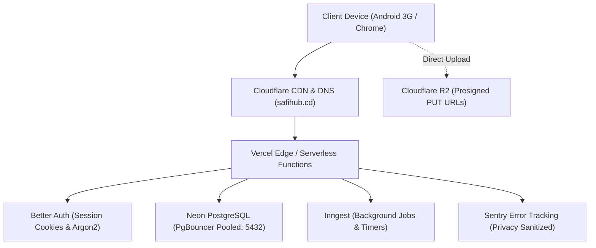

# SafiHub — Production Deployment & Disaster Recovery Runbook

> **Target Platform**: Vercel (Next.js 16.3 / React 19 App Router) + Neon PostgreSQL (Serverless + PgBouncer) + Cloudflare R2 + Sentry  
> **Production Domain**: `safihub.cd` (Official) / `app.safihub.cd`  
> **Target Region**: Primary edge nodes nearest to DRC / Central & East Africa (e.g. Frankfurt `fra1` / Johannesburg `jnb1`).

---

## 1. Production Architecture Overview



---

## 2. Environment Variables Specification

All production secrets must be securely configured in the Vercel Project Settings (Environment: `Production` only):

| Variable Name | Required | Example / Description |
| :--- | :--- | :--- |
| `DATABASE_URL` | **YES** | Direct connection string for migrations (`drizzle-kit migrate`). |
| `DATABASE_URL_POOLED` | **YES** | PgBouncer connection string for App Router serverless actions. |
| `BETTER_AUTH_SECRET` | **YES** | 64-character random hex string (`openssl rand -hex 32`). |
| `BETTER_AUTH_URL` | **YES** | `https://safihub.cd` (must match production canonical URL). |
| `R2_ACCOUNT_ID` | **YES** | Cloudflare account identifier. |
| `R2_ACCESS_KEY_ID` | **YES** | Cloudflare R2 API token access key. |
| `R2_SECRET_ACCESS_KEY` | **YES** | Cloudflare R2 API token secret key. |
| `R2_BUCKET_NAME` | **YES** | `safihub-prod-photos` |
| `R2_PUBLIC_URL` | **YES** | `https://photos.safihub.cd` (or private presigned gateway). |
| `SENTRY_DSN` | **YES** | Production Sentry project ingestion DSN. |
| `SENTRY_ORG` | **YES** | Sentry organization slug. |
| `SENTRY_PROJECT` | **YES** | Sentry project slug (`safihub`). |
| `POSTHOG_API_KEY` | Optional | PostHog server-side events API key. |
| `UPSTASH_REDIS_REST_URL` | Optional | Upstash Redis REST URL for distributed rate limiting. |
| `UPSTASH_REDIS_REST_TOKEN` | Optional | Upstash Redis token. |

---

## 3. Neon PostgreSQL Point-In-Time Restore (PITR) Procedure

Neon provides continuous write-ahead logging (WAL) enabling point-in-time recovery to any second within the retention window.

### 3.1 Simulated & Verified Backup Drill
- Test suite: `src/services/db/__tests__/backup-restore.test.ts`
- Verified: Complete state reconstruction, zero financial discrepancy in `cash_ledger`, and retention of integer minor units.

### 3.2 Production Recovery Steps (Disaster Recovery Drill)
In the event of accidental data corruption or disaster:
1. **Identify Timestamp**: Identify the exact UTC timestamp immediately preceding the incident (e.g. `2026-10-15T14:32:00Z`).
2. **Branch Restoration via Neon CLI**:
   ```bash
   neon branches create \
     --project-id ep-cold-rain-b2q4m2ga \
     --name recovery-20261015-1432 \
     --parent main \
     --timestamp 2026-10-15T14:32:00Z
   ```
3. **Verify Integrity**: Inspect the restored branch via Drizzle Studio:
   ```bash
   DATABASE_URL="<restored_branch_connection_string>" pnpm db:studio
   ```
4. **Switch Vercel Connection**:
   Update `DATABASE_URL_POOLED` in Vercel to point to the newly verified branch endpoint.
5. **Redeploy / Invalidate Cache**: Trigger a deployment promotion in Vercel.

---

## 4. Sentry Error Tracking & Admin Alerting

1. **Privacy Firewall Scrubbing**:
   - Customer phone numbers, street landmarks, and sensitive credentials are automatically scrubbed from Sentry events (`src/lib/sentry-privacy.ts`).
   - Only user roles (`customer`, `courier`, `house`, `admin`) and error traces are recorded.
2. **Alert Rules**:
   - **Critical Error Trigger**: Alert dispatched via Email + WhatsApp webhook when unhandled exceptions occur in `transitionOrder`, `recordPickupCount`, or `cash_ledger` mutations.
   - **Repeated Order Expiry**: Alert triggered if >= 3 orders expire within 2 hours without house acceptance (indicating possible house power or internet outage in Bukavu).
3. **Manual Verification Action**:
   - `triggerTestSentryErrorAction()` in `src/actions/debug-sentry.action.ts` can be triggered by an admin to confirm alert delivery.

---

## 5. Production Uptime & Health Check Monitoring

- **Synthetic Ping Endpoints**:
  - `GET /` (Homepage shell - checks edge cache & static assets)
  - `GET /api/auth/get-session` (Checks session endpoint & database responsiveness)
- **Monitoring Service**: Better Uptime / Checkly configured with a 60-second ping interval.
- **Escalation**: If downtime exceeds 2 minutes, SMS notification is dispatched to the admin operations phone (+243...).
